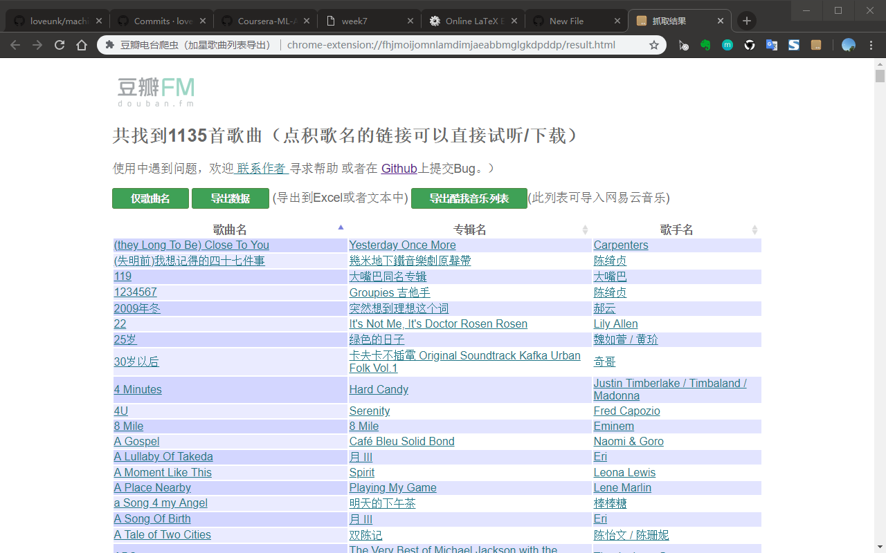

# 豆瓣电台加心歌曲爬虫 ❤

这是一个维护了很多年的Chrome插件，用来获取完整的豆瓣加心歌曲（也就是你收藏的那些）列表，并以列表的形式呈现。

支持列表导出，试听下载等.. 简单易用，只用点一下按键，希望能帮到你。

[Chrome Store 插件安装地址](https://chrome.google.com/webstore/detail/%E8%B1%86%E7%93%A3%E7%94%B5%E5%8F%B0%E7%88%AC%E8%99%AB%EF%BC%88%E5%8A%A0%E6%98%9F%E6%AD%8C%E6%9B%B2%E5%88%97%E8%A1%A8%E5%AF%BC%E5%87%BA%EF%BC%89/biegmkgmmglpkeapmlkfpbihllbplaef?hl=zh-CN)

因为豆瓣电台经常变更网站样式或是数据获取方式，导致需要经常适配JavaScript code，如果你发现Bug
* 请在这里提交Issue，或
* 或者你已经fix可以直接submit pull request (preferred)

---

自动抓取 豆瓣电台加星歌曲，并提供列表导出功能
如果您经常使用Douban.fm，那您一定收藏了很多好听的歌曲！

也许您想把歌曲列表导出到其他本地播放器，比如“网易云音乐”...

可惜豆瓣电台现在还不支持加❤歌曲列表的导出...

没关系，有了这个小扩展，一切都搞定！

【使用方法】:
1. 打开豆瓣电台，确认已经登录（可以在douban.fm查看登录状态）
2. 点击插件的图标（就Chrome右上角的豆瓣电台图标），之后会有个小窗口弹出
3. 点击窗口的按钮。然后等待程序运行完毕（如果您有几千首加❤歌曲的话，可能需要几分钟的时间）
4. 如果一切顺利，会出现一个歌曲列表。您把列表中的内容，copy & paste到您的本地即可（比如Excel，记事本）。
** 也可以导出“酷我音乐列表”，此列表可导入“网易云音乐”

---
## Changelog
-- update 2019/2/24
很久没更新了，发现豆瓣又又又更新了它的加❤歌曲的呈现和获取方式，于是重新适配

-- update 2016/5/27
感谢Junting Jin的提议，添加新功能：导出“酷我音乐列表”，此列表可导入“网易云音乐”

-- update 2015/9/13
感谢WEN Pingbo (wengpingbo)提交的patch，修复了一个因为Douban Tag变化导致的Bug

-- update 2014/6/26
感谢上海交大的Anana(anana#sjtu)提交的更新，修复了一下corner case bug，并新增垃圾箱歌曲导出

-- update 2013/7/14
豆瓣修改了style导致抓取错误，修复了这个问题。并按照Google规定update manifest到version 2

-- update 2012/5/24
有用户反映：复制表格到excel后不能正常显示。新增导出按钮，显示纯文字表格内容，解决此问题

-- update 2012/5/21
优化了界面，更新了生成结果的样式，新增排序功能

-- update 2011/10/31
最近有朋友提示说用不了了，我试了下的确是，因为Douban改了html的layout，今天简单改了改就行了。

-- update 2011/5/26
今天发现一个问题，如果是从www.douban.com登录的豆瓣，然后直接使用这个扩展，会提示没有登录，您可以打开douban.fm登录后重试

## Thanks

